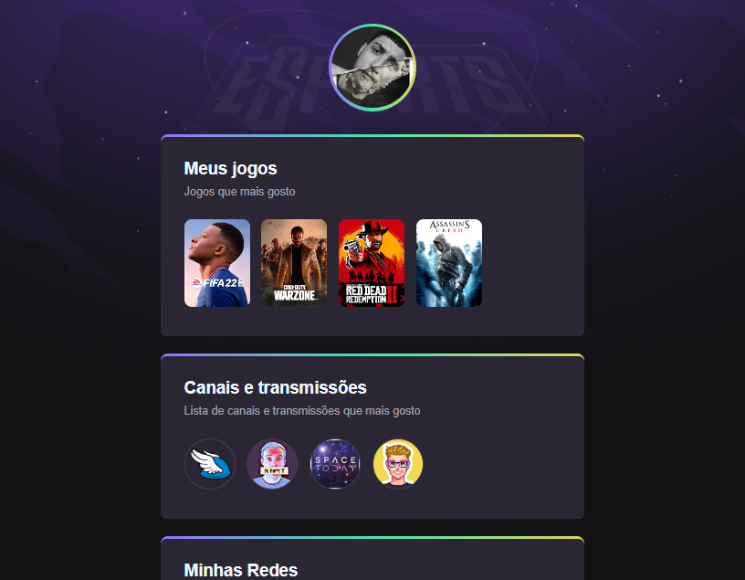

# NLW eSports

> Trilha Explorer

Projeto construido com base no evento 
Next Level Week da Rocketseat. 🚀 

[🔗 Clique aqui para acessar](https://hugosaladini.github.io/NLW/)

## 🛠️Tecnologias 

- HTML 
- CSS
- Git e Github

## 📑 Aprendizado complementar

- Aplicar movimento/dinamismo de tela apenas com CSS
- Estruturação de um README
- Comandos de utilização de git com github

## 📧 Contato

- hg.saladini@gmail.com  
